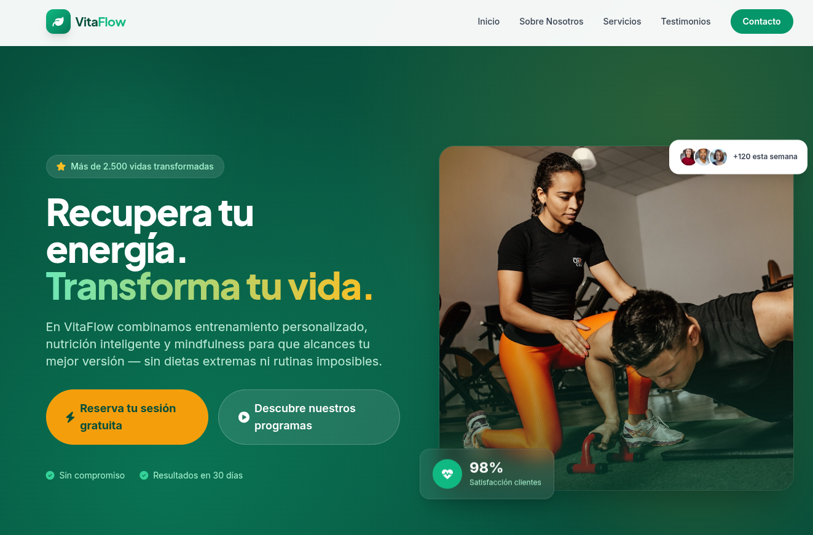

# PFO2 - Prompt Engineering en Agentes de IA

## Datos del Estudiante
- **Nombre y Apellido:** Iván Ariel Faigenbom
- **Comisión:** Lunes
- **Fecha de Entrega:** 26/06/2026

## Deploy Unificado
- **Link de Vercel:** https://ifts-29-front-pfo-2.vercel.app/

---

## Prompt Exacto Utilizado
A continuación se detalla el prompt en inglés optimizado bajo las guías de Anthropic/OpenAI:

ROLE: Act as a Senior Frontend Software Engineer, expert in UX/UI and Conversion Rate Optimization (CRO).

CONTEXT: I need you to generate a professional, modern, fully responsive, and completely self-contained Landing Page for [Insert your niche/topic here]. I am restricted from editing the code manually, so your output must be flawless, fully functional, and production-ready with zero incomplete placeholders.

DESIGN & TECH SPECIFICATIONS:
- Use modern HTML5 and Tailwind CSS via CDN (include  in the <head>).
- Use FontAwesome via CDN for clean, modern icons (<link rel="stylesheet" href="https://cdnjs.cloudflare.com/ajax/libs/font-awesome/6.4.0/css/all.min.css">).
- Ensure a mobile-first responsive design, clean typography, and a cohesive color palette matching the specific business niche.

MANDATORY PAGE STRUCTURE (In order):
1. HEADER: Fictional logo/brand name and a responsive navigation menu (Inicio, Sobre Nosotros, Servicios, Testimonios, Contacto). Includes a working mobile burger-menu toggle.
2. HERO SECTION: A powerful main headline (H1), a persuasive subheadline, a prominent Call-to-Action (CTA) button, and an eye-catching visual element (using tailored CSS patterns or high-quality stock images from Unsplash).
3. ABOUT US: A dedicated section explaining the core value proposition and mission of the business.
4. SERVICES / FEATURES: A grid layout featuring 3 or 4 cards detailing core services/features, each accompanied by a relevant icon.
5. TESTIMONIALS: At least 3 fictional customer reviews, including full names, realistic avatars (use Unsplash placeholder URLs), and a 5-star rating layout.
6. CONTACT FORM: A visually complete mockup form with fields for Name, Email, Message, and a submit button. (UI layout only, no backend required).
7. FOOTER: Copyright notice, fictional legal/privacy links, and social media icons (Instagram, X, LinkedIn).

STRICT RESTRICTIONS:
- OUTPUT LANGUAGE: All user-facing text, titles, buttons, and copywriting on the landing page MUST be written in persuasive, high-quality, natural SPANISH. "Lorem Ipsum" is strictly forbidden.
- Deliver the entire project inside a SINGLE, self-contained "index.html" file (HTML, CSS custom tweaks, and minor JavaScript for interaction like the mobile menu must live together).
- DO NOT use code-splitting or placeholders like "". Write every single line from <html> to </html>.
- Ensure smooth scrolling navigation when clicking on header anchor links (#section).

OUTPUT: Return ONLY the complete, raw HTML code block. No explanations, no introductory text.

### Agente 1: Cursor 
- **Modelo:** Composer - 2.5 Fast.
- **Resultado:** La landing page de VitaFlow presenta una estructura excepcionalmente limpia y profesional, destacando por un diseño moderno que aprovecha al máximo Tailwind CSS
				 con una paleta de colores verdes muy cohesiva y estética. Técnicamente está excelentemente lograda,
				 incorporando secciones semánticas completas (Hero, Sobre Nosotros, Servicios, Testimonios y Contacto).
				 El nivel de detalle en la configuración de tipografías y la optimización de las imágenes de Unsplash da como resultado un producto final de altísima calidad, 
				 completamente digno de un entorno de producción real.
- **Captura de Pantalla:** 

### Agente 2: GitHub Copilot - VsCode
- **Modelo:** GPT-4o (Default Model).
- **Resultado:** La propuesta de Impulso Digital destaca por un enfoque tecnológico y corporativo muy pulido, utilizando una estética dark mode impecable sobre tonos pizarra con acentos en cian y 
				 ámbar que estructuran la lectura a la perfección. A nivel técnico, el código es directo y ordenado, resolviendo la interactividad mediante un script nativo simple para el menú móvil e 
				 implementando grillas responsivas sumamente robustas en todas sus secciones. 
				 Aunque arriesga menos en lo visual en comparación con VitaFlow, logra una interfaz sofisticada, equilibrada y orientada de forma sumamente efectiva a la conversión.
- **Captura de Pantalla:** 

### Aclaración final sobre el Trabajo
El prompt se realizó utilizando a la IA como guía en su creación, siguiendo los lineamientos detallados por el profesor en la consigna y los links a las guías de Anthropic y OpenAI. Es de público conocimiento la eficiencia en tokens que supone escribir prompt en inglés con respecto al español y otros idiomas. Por lo que una vez diseñado el prompt en español se procedió a traducirlo al inglés para realizar la prueba de los agentes.
